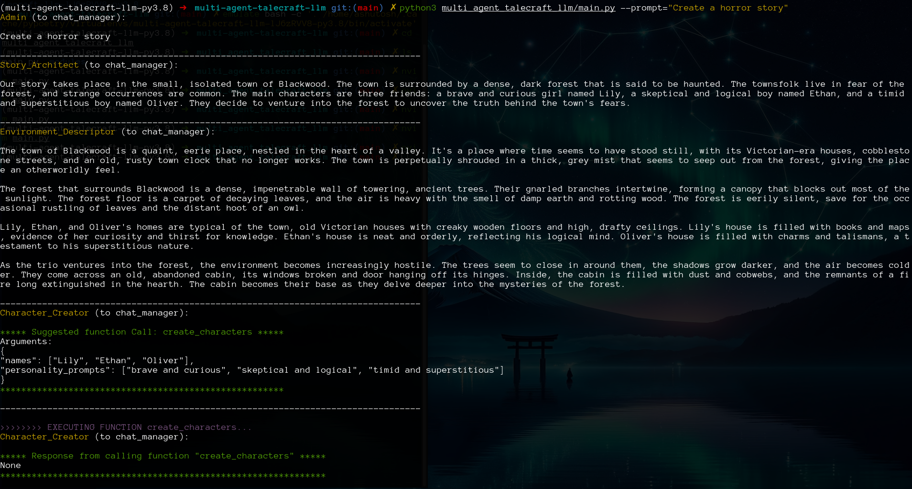
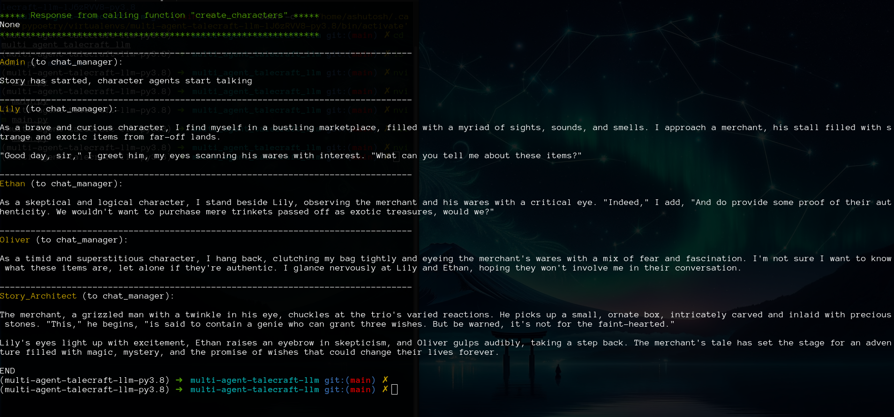

## Story driven by multiple LLM agents
- User_Proxy agent - mimics the user
- Story_Architect agent - creates the narrative
- Character_Creator agent - creates characters on story architect's request

### TODO
- Newly created characters need context, they go off on a different tangent.

